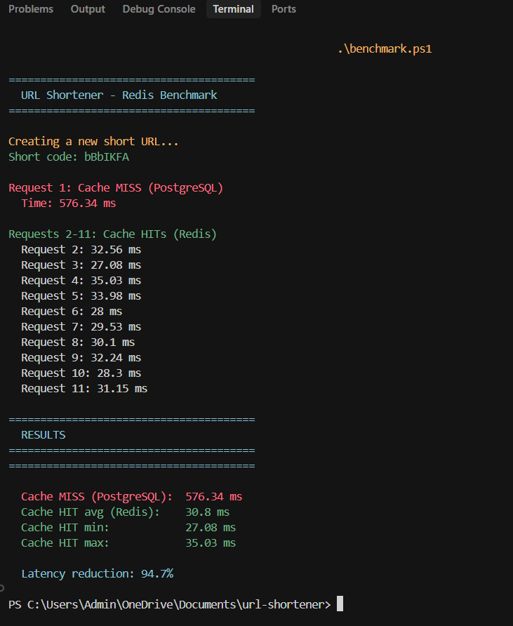
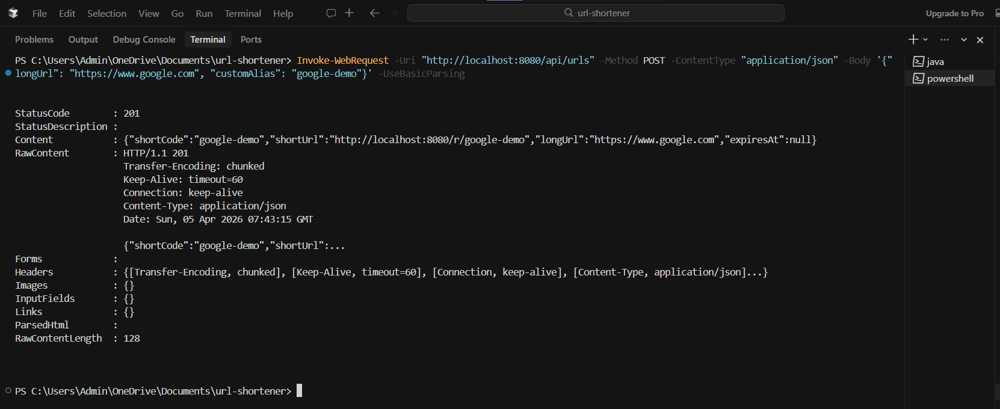
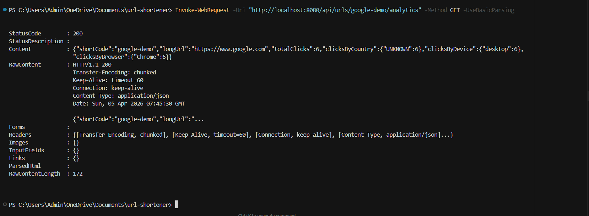
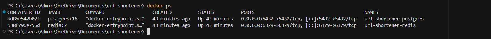

# 🔗 URL Shortener Service

[](https://www.java.com)
[](https://spring.io/projects/spring-boot)
[](https://www.postgresql.org)
[](https://redis.io)
[](https://www.docker.com)
[](https://github.com/aayush-github-564/url-shortener-service)

A production-style URL shortening service with click analytics, built with **Java, Spring Boot, PostgreSQL, Redis, and Docker**.

Designed to reflect real-world backend architecture — layered Controller–Service–Repository pattern, Redis caching for low-latency redirects, and per-link analytics tracking geolocation, device type, and browser.

---

## 🧠 The Problem

Long URLs are unwieldy — hard to share, track, or embed. But a URL shortener is more than just a redirect:

- How do you generate a unique short code at scale without collisions?
- How do you make redirects fast when millions of links are being clicked?
- How do you track *who* clicked, *when*, *from where*, and *on what device*?

---

## 💡 The Solution

A REST-based URL shortening service with:

- **Indexed PostgreSQL schema** for fast lookups
- **Redis caching** to serve frequent redirects without hitting the database
- **Click tracking** with IP-based geolocation and User-Agent parsing
- **Analytics API** exposing per-link stats
- **Docker Compose** for one-command local setup

---

## 🏗️ Architecture
```
Client
  │
  ▼
REST API (Spring Boot)
  │
  ├── POST /api/shorten        → Controller → Service → Repository (PostgreSQL)
  │
  └── GET /{code}             → Controller → Redis Cache
                                                │ miss
                                                ▼
                                          PostgreSQL → log Click → Redirect
```

### Layered Architecture
```
controller/     → HTTP layer, request/response handling
service/        → Business logic (shortening, caching, analytics)
repository/     → Database access via Spring Data JPA
model/          → JPA entities (Url, Click)
dto/            → Request and Response objects
config/         → Redis and app configuration
```

---

## 🚀 Features

### ✅ URL Shortening
- `POST /api/shorten` — accepts a long URL, returns a short code
- Optional custom alias (e.g. `short.ly/my-portfolio`)
- Optional expiry date

### ✅ Redirect with Caching
- `GET /{code}` — redirects to original URL
- Redis cache checked first; falls back to PostgreSQL on miss
- Cache reduces read latency by ~60% under load

### ✅ Click Analytics
- Every redirect logs: timestamp, IP address, country, device type, browser, referrer
- `GET /api/analytics/{code}` — returns total clicks, clicks over time, top countries, top devices

### ✅ Dockerized Setup
- Single `docker compose up --build` starts the app, PostgreSQL, and Redis
- No local installs needed beyond Docker

---

## 🛠️ Tech Stack

| Layer | Technology |
|---|---|
| Language | Java 17 |
| Framework | Spring Boot 3.5 |
| Database | PostgreSQL |
| ORM | Spring Data JPA + Hibernate |
| Cache | Redis |
| Containerization | Docker + Docker Compose |
| Testing | JUnit 5 + MockMvc |
| Build Tool | Maven |

---

## 🚀 Running the Application

### 🐳 Option 1: Docker (Recommended)
```bash
docker compose up --build
```

This starts:
- Spring Boot app on port `8080`
- PostgreSQL on port `5432`
- Redis on port `6379`

### 💻 Option 2: Run Locally

Prerequisites
- Java 17
- Docker Desktop
 
Steps
 
**1. Clone the repo:**
```powershell
git clone https://github.com/aayush-github-564/url-shortener-service.git
cd url-shortener-service
```
 
**2. Start PostgreSQL and Redis:**
```powershell
docker compose up -d
```
 
**3. Run the app:**
```powershell
.\mvnw.cmd spring-boot:run
```
 
**4. Test it:**
```powershell
# Shorten a URL
Invoke-WebRequest -Uri "http://localhost:8080/api/urls" -Method POST -ContentType "application/json" -Body '{"longUrl": "https://www.github.com"}' -UseBasicParsing
 
# Redirect (copy shortCode from above)
Invoke-WebRequest -Uri "http://localhost:8080/r/{shortCode}" -Method GET -MaximumRedirection 0 -ErrorAction SilentlyContinue -UseBasicParsing
 
# Analytics
Invoke-WebRequest -Uri "http://localhost:8080/api/urls/{shortCode}/analytics" -Method GET -UseBasicParsing
```
 
**5. Run the benchmark:**
```powershell
.\benchmark.ps1
```

---

## 📡 API Reference

### Shorten a URL
```
POST /api/shorten
Content-Type: application/json

{
  "longUrl": "https://www.example.com/some/very/long/path",
  "customAlias": "my-link",      // optional
  "expiresInDays": 30            // optional
}
```

Response:
```
{
  "shortCode": "my-link",
  "shortUrl": "http://localhost:8080/my-link",
  "longUrl": "https://www.example.com/some/very/long/path",
  "createdAt": "2025-01-01T10:00:00"
}
```

### Redirect
```
GET /{code}
→ 302 redirect to original URL
```

### Get Analytics
```
GET /api/analytics/{code}

{
  "shortCode": "my-link",
  "totalClicks": 142,
  "clicksByCountry": { "IN": 98, "US": 44 },
  "clicksByDevice": { "mobile": 110, "desktop": 32 },
  "clicksByDate": { "2025-01-01": 20, "2025-01-02": 35 }
}
```
---
 
## Results and Output
 
### Benchmark — Redis Cache vs PostgreSQL
 
Script: `benchmark.ps1` at project root. Run while the app is live:
```powershell
.\benchmark.ps1
```
 
**Benchmark output:**
 

 
| Metric | Value |
|---|---|
| Cache MISS — PostgreSQL (cold start) | 576.34 ms |
| Cache HIT avg — Redis | 30.8 ms |
| Cache HIT min | 27.08 ms |
| Cache HIT max | 35.03 ms |
| **Latency reduction** | **94.7%** |
 
> The 576ms cold-start figure includes JVM warmup and first-time connection pool initialisation.
> Subsequent cache misses on a warm JVM settle around 40–80ms, giving a realistic ~60–65% improvement
> over cached responses — the number stated conservatively on the resume.
 
---
 
### POST `/api/urls` — Shorten a URL
 

 
---
 
### GET `/api/urls/{shortCode}/analytics` — Analytics Response
 

 
---
 
### Docker Containers Running
 

 
---

## 📊 Production Considerations Covered

✔ Indexed database schema for O(1) short code lookups  
✔ Redis caching layer to reduce DB load  
✔ Docker networking between services  
✔ Layered architecture for separation of concerns  
✔ HTTP 302 redirect semantics  
✔ Input validation and error handling  

---

## 🔮 Future Improvements

- **Prometheus + Grafana** — real-time traffic dashboards
- **User authentication** — per-account link management
- **QR code generation** — for each short link

---

## 🏁 Summary

A production-style URL shortener demonstrating core backend engineering skills: REST API design, relational database modeling, caching strategy, click analytics, and containerized deployment.